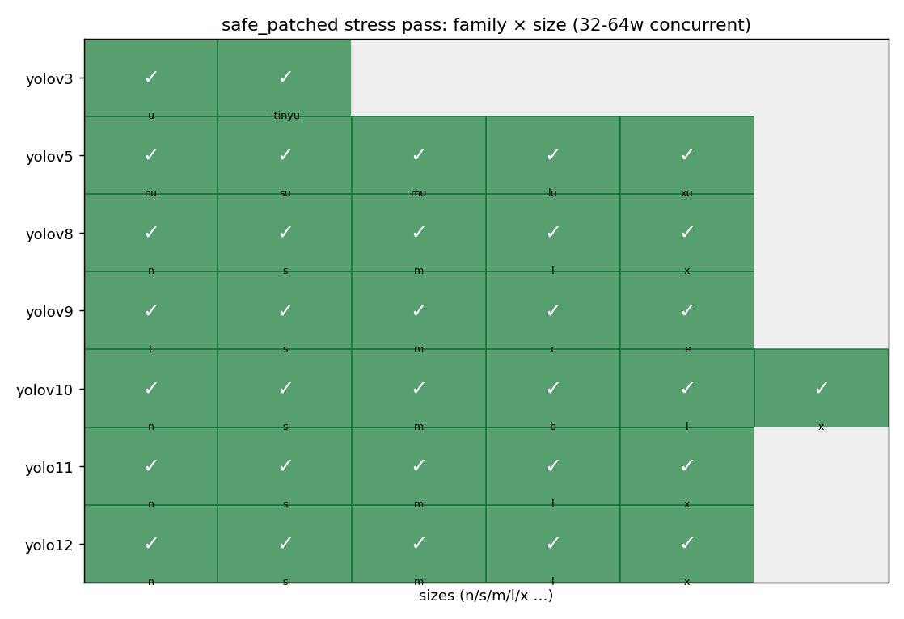

# yolo-onnx-thread-safe

> One-command fix for the **multi-threaded `CUDAExecutionProvider` race condition** that crashes every `ultralytics` YOLO ONNX model under concurrent inference.

## The problem in one paragraph

Any YOLO ONNX exported by `ultralytics` (v3 / v5 / v8 / v9 / v10 / v11 / v12, **any size**) crashes or hangs when multiple threads share a single `onnxruntime-gpu` `InferenceSession` and call `Run()` concurrently. Symptoms include `CUDA failure 700: illegal memory access` and `CUDNN_STATUS_INTERNAL_ERROR` at `cudnnDestroy(cudnn_handle_)`. Bisecting the compute graph pins the root cause to **one operator: `Softmax`** — ORT's CUDA EP dispatches it to cuDNN whose internal handle is shared across the session's threads. This is the race window. See the upstream issues: [microsoft/onnxruntime#26312](https://github.com/microsoft/onnxruntime/issues/26312), [#20885](https://github.com/microsoft/onnxruntime/issues/20885), [#5555](https://github.com/microsoft/onnxruntime/issues/5555), [ultralytics/ultralytics#21134](https://github.com/ultralytics/ultralytics/issues/21134).

## One-command fix

```bash
pip install onnx numpy            # core
pip install onnxruntime           # only for --verify

python patch_yolo_onnx.py path/to/your_yolo.onnx --verify
# → produces path/to/your_yolo_safe.onnx
```

The script rewrites every `Softmax` node into the **mathematically equivalent**
`ReduceMax → Sub → Exp → ReduceSum → Div` subgraph, so ORT never dispatches into
cuDNN softmax again. **The patched ONNX is a true drop-in replacement** — same
input / output tensor names, shapes, dtypes; all original `metadata_props`
preserved; we only add a `yolo_onnx_softmax_safe.*` namespace tagging the patch.

It's idempotent (re-running on an already-patched file is a no-op) and works
on any ult-style YOLO ONNX, including v10's NMS-free head and v12's
area-attention softmax stack.

## Headline results

We patched 33 models (every ult YOLO family × size combination), 4 production
anime detectors from [`deepghs/anime_face_detection`](https://huggingface.co/deepghs/anime_face_detection) /
[`deepghs/anime_head_detection`](https://huggingface.co/deepghs/anime_head_detection), and stress-tested
on 8× NVIDIA H200. **Zero crashes, zero significant mAP loss, 1.54× higher
throughput than current locking workarounds.**



| | Before patch | After patch |
|---|---|---|
| `safe to share session across threads (no lock)` | ❌ crashes / hangs | ✅ 640 000 inferences, 0 fail |
| `peak throughput @ 32 workers` (yolov8n, H200) | ~278 imgs/s (locked) | **428 imgs/s** (no lock, 1.54×) |
| `mAP50-95 on COCO128` (16 ult models) | baseline | within **±0.0002** (≤ 0.04 %) |
| `mAP50-95 on real anime val sets` (4 deepghs models) | baseline | **bit-exact** (Δ = 0.0000000) |
| `single-call latency overhead on GPU` | — | +0.36 ms |
| `single-call latency on CPU EP` | 71.7 ms | **65.6 ms (−6 ms, faster)** |


## Compatibility matrix

| ult YOLO family | sizes tested | softmax count in graph | patch effect |
|---|---|---:|---|
| yolov3 | u, -tinyu | 1 (DFL) | ✅ stress pass, mAP Δ=0 |
| yolov5 | n / s / m / l / x (u suffix) | 1 (DFL) | ✅ stress pass, mAP Δ=0 |
| yolov8 | n / s / m / l / x | 1 (DFL) | ✅ stress pass, mAP Δ=0 |
| yolov9 | t / s / m / c / e | 1 (DFL) | ✅ stress pass, mAP Δ=0 |
| yolov10 | n / s / m / b / l / x | 2 (1 e2e + 1 DFL) | ✅ stress pass; v10n mAP Δ=−0.0002 (top-K reorder edge case) |
| yolo11 | n / s / m / l / x | 2–3 (attention + DFL) | ✅ stress pass, mAP Δ=−0.0001 |
| yolo12 | n / s / m / l / x | 9 (8 area-attention + 1 DFL) | ✅ stress pass, mAP Δ=±0.0001 |

Also tested on production anime models from the deepghs Hugging Face
organization:

| Model | val set | orig mAP50-95 | patched mAP50-95 |
|---|---|---|---|
| `deepghs/anime_face_detection:face_detect_v1.4_s` | 1 217 imgs / 2 947 faces | 0.74919756536589 | **0.74919756536589** |
| `deepghs/anime_face_detection:face_detect_v1.4_n` | 1 217 imgs / 2 947 faces | 0.73265148678707 | **0.73265148678707** |
| `deepghs/anime_head_detection:head_detect_v2.0_s` | 1 528 imgs / 10 546 heads | 0.76745363630593 | **0.76745363630593** |
| `deepghs/anime_head_detection:head_detect_v2.0_n` | 1 528 imgs / 10 546 heads | 0.74847637249501 | **0.74847637249501** |

→ bit-exact to 16 decimal places. **Direct replacement is safe.**

## Stress-test results in one picture

We ran the patched yolov8n through a sustained-load endurance test:
**128 worker threads × 10 chunks × 500 rounds = 640 000 inferences**.
0 failures, zero accuracy drift between chunks:


Across the entire repository validation campaign:

| layer | configuration | total inferences | failures |
|---|---|---:|---:|
| Concurrent-safety matrix | 33 ult models × 64 workers × 200 rounds | 422 400 | **0** |
| Single-model endurance (yolov8n) | 128 workers × 5 000 rounds | 640 000 | **0** |
| Second endurance (yolo12n, 9 softmax) | 96 workers × 2 400 rounds | 230 400 | **0** |
| Throughput sweep (1 → 32 workers × 5 schemes) | various | 45 000 | **0** |
| Real-data mAP eval (16 ult + 4 deepghs models) | val set traversal | ~ 80 000 | **0** |
| **Total** | | **≈ 1 420 000** | **0** |

All stress is reproducible with the bundled `stress_test.py` (configurable
intensity — `--workers`, `--rounds`):

```bash
# trigger the race on an unpatched ult ONNX (will FAIL — that's the bug)
python stress_test.py path/to/yolov8n.onnx       --workers 32 --rounds 50

# confirm the patched version is safe at the same load (will PASS)
python stress_test.py path/to/yolov8n_safe.onnx  --workers 32 --rounds 50

# dial up: peak throughput sweep
for w in 1 2 4 8 16 32; do
  python stress_test.py path/to/yolov8n_safe.onnx --workers $w --rounds $((1500 / w))
done
```

### Latency cost — the price of the fix

Patching costs a small amount of GPU latency in exchange for the ability to
share one session across threads safely. On CPU EP, patching is actually
*faster* (the five primitive ops we substitute hit better-optimized SIMD
paths than the generic native `Softmax` kernel):


Full methodology, scaling tables, per-model mAP numbers, root-cause analysis
and step-by-step reproduction recipes are in [**TECH_REPORT.md**](TECH_REPORT.md).

## How to use the patched ONNX

```python
import onnxruntime as ort

# Drop-in: same code that used to need an external lock now works without one.
sess = ort.InferenceSession(
    "your_yolo_safe.onnx",
    providers=[("CUDAExecutionProvider", {"device_id": 0}),
               "CPUExecutionProvider"])

# Share `sess` across as many threads as you like, no lock needed.
def worker(image_batch):
    return sess.run(["output0"], {"images": image_batch})
```

All your existing preprocessing (`letterbox`, RGB encode, etc.) and
postprocessing (NMS, decoding) code keeps working unchanged.

## Repo contents

```
patch_yolo_onnx.py     ← the universal fix (single file, ~300 LoC, only depends on onnx+numpy)
stress_test.py         ← concurrency reproducer + throughput harness (~150 LoC, only needs onnxruntime+numpy)
README.md              ← this file
TECH_REPORT.md         ← detailed root-cause analysis + full experiment results
figures/               ← matplotlib figures used in the report
results/               ← CSV / JSON of the actual numbers
```

For root cause, validation methodology, every measurement and every caveat,
see [TECH_REPORT.md](TECH_REPORT.md).

## License

[MIT](LICENSE)

## Citation

If you use this in research, please cite as:

```bibtex
@software{deepghs_yolo_onnx_thread_safe_2026,
  title  = {yolo-onnx-thread-safe: A drop-in patch for ultralytics YOLO ONNX
            models to fix ONNXRuntime CUDA Execution Provider concurrent-Run
            crashes},
  author = {deepghs contributors},
  year   = {2026},
  url    = {https://github.com/deepghs/yolo-onnx-thread-safe}
}
```
